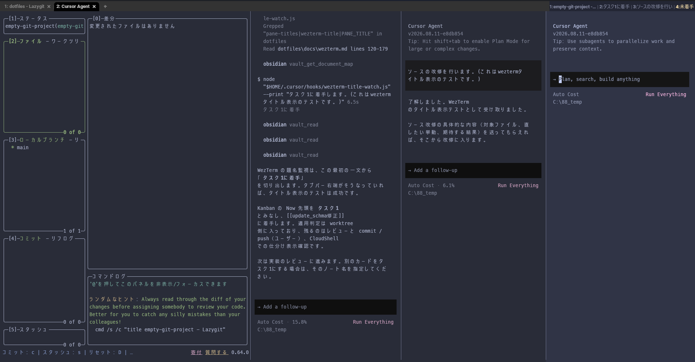

# agent-workbench（WezTerm + Neovim + AI 並列エージェント）

Windows / macOS / Linux で、WezTerm 上に lazygit と AI agent（既定は Cursor CLI）を並べて使う環境。既定シェルは **bash**（macOS でも zsh ではなく bash）。agent は `agent-use` で Claude / Gemini / Copilot / Codex に切り替えられる。

## 画面の構成



比率は lazygit : agent×3 = 5 : 3 : 3 : 3。タブバー右端に `番号:題名`。操作中のペインは黄色＋太字。

- **左**: lazygit。Git の状態をまとめて見る
- **右3つ**: 別タスクの AI agent（`agent`）。同じディレクトリでも会話はペインごとに独立
- **作業内容の見え方**: Cursor のときは最初のプロンプトを短くして、タブバー右端に `番号:題名` で並べる。起動直後と `/clear` 後は `未着手`。他の agent は起動時にプロバイダ名、あとは `title 作業名`
- 左右並びは `|`、上下並びは `/`。プロンプト行にも `[題名]` が出る（Oh My Posh）
- AI agent の切替: `agent-use claude`（設定は `~/.wezterm-agent.conf`）

詳細は [docs/wezterm.md](docs/wezterm.md)。

## 構築方法

**clone したあと `./setup.sh` だけ実行する。** 最初に環境（Windows / macOS / Linux / WSL）と AI agent を選ぶと、ツール導入と設定配置まで同じ流れで入る。

設定コピーだけなら `install.sh`、ツールだけなら `bootstrap.sh`。Git / bash が無いときは [docs/prerequisites.md](docs/prerequisites.md)。

### 1. clone する

```bash
git clone https://github.com/iidaka-joji-0218/agent-workbench.git ~/src/agent-workbench
cd ~/src/agent-workbench
```

Windows の Git Bash なら `~/src` は `/c/Users/<名前>/src` になる。

### 2. 共通インストール

オプションは付けずに実行する。番号を打って Enter。空 Enter なら `[ ]` 内の既定になる。

先に内容だけ見るなら `./setup.sh --dry-run`（ダウンロードもコピーもしない）。

Windows で Cursor を使うときの入力例:

```text
$ ./setup.sh
このマシンの環境を選んでください。
  検出: windows

  1) Windows   WezTerm もツールも Windows（Git Bash）
  2) macOS
  3) Linux     WezTerm もツールも Linux
  4) WSL       ツールは Linux、WezTerm の設定だけ Windows へ

番号 [1]: 1

右ペインで使う AI agent を選んでください（あとから agent-use で変更できます）。
  1) cursor    Cursor CLI（cursor-agent）
  2) claude    Claude Code
  3) gemini    Gemini CLI
  4) copilot   GitHub Copilot CLI
  5) codex     OpenAI Codex CLI

番号 [1]: 1

==== インストール内容 ====
  環境:     windows
  ツールOS: windows
  AI agent: cursor （ペインでは agent 、切替は agent-use）
  作業:     未導入ツールの導入 → 設定ファイルの配置

この内容で進めますか？ [Y/n]: Y
```

macOS で Claude なら、1問目に `2`、2問目に `2`、最後は `Y`。Linux は `3`、WSL は `4`（WezTerm 本体は Windows 側）。検出と違う番号を選ぶとエラーになる。

CI など対話できないときだけオプションを付ける。

```bash
./setup.sh --os windows --yes --agent cursor
./setup.sh --os wsl --yes --windows-home '/mnt/c/Users/名前'
```

winget / Homebrew には依存しない。失敗時の手動手順は [docs/prerequisites.md](docs/prerequisites.md)。

### 3. 設定の配置先（setup / install が行う）

| リポジトリ | 配置先 |
| --- | --- |
| `wezterm/wezterm.lua` | `~/.wezterm.lua`（WSL 選択時は Windows のホーム） |
| `wezterm/wezterm-dirs.txt.example` | `~/.wezterm-dirs.txt`（無いときだけ） |
| `agent/agent.conf.example` | `~/.wezterm-agent.conf`（setup の選択、または無いときだけ） |
| `bash/bashrc` | `~/.bashrc`（macOS は `~/.bash_profile` から読むよう足す） |
| `nvim/*` | Windows: `%LOCALAPPDATA%/nvim/` ／ macOS・Linux: `~/.config/nvim/` |
| `cursor/hooks/wezterm-title-watch.js` | `~/.cursor/hooks/` |
| `oh-my-posh/light.omp.json` | `~/.config/oh-my-posh/`（Windows は `~/Apps/oh-my-posh/` にも） |

### 4. 起動と初回ログイン

1. **WezTerm を一度終了して起動し直す**（パスとフォントを拾う）
2. 新しいタブで次を確認する

```bash
wezterm --version
node -v
lazygit --version
command -v nvim
command -v oh-my-posh || ls "$HOME/Apps/oh-my-posh/oh-my-posh.exe"
command -v agent || ls "$HOME/.local/bin/agent"
```

3. 選んだ AI agent にログインする（Cursor なら `agent login`）

```bash
agent-use          # 現在の provider
agent login        # 各 CLI のログイン（対応しているもの）
```

4. よく使うフォルダを `~/.wezterm-dirs.txt` に 1 行 1 パスで書く

5. `Ctrl+Shift+T` で worktree 確認 → lazygit + agent×3 が開くこと

## 操作の要点

- `Ctrl+Shift+T` … worktree 確認のうえ lazygit + agent×3
- `Alt+矢印` … ペイン移動
- `Ctrl+Shift+Z` … ズーム
- `Shift+Alt+W` … ペインを閉じる
- `title 作業名` … タブバーの題名を手動設定
- `agent-use claude` … 右ペインの AI agent を切り替える

詳細は [docs/wezterm.md](docs/wezterm.md) と [docs/neovim.md](docs/neovim.md)。

